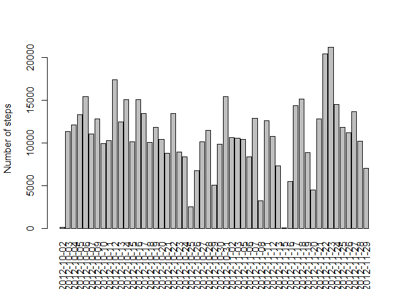
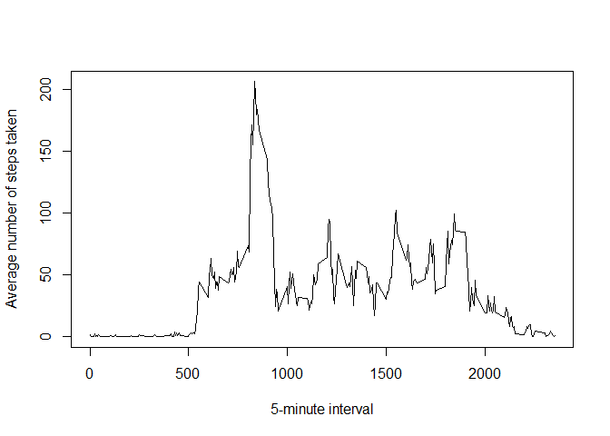
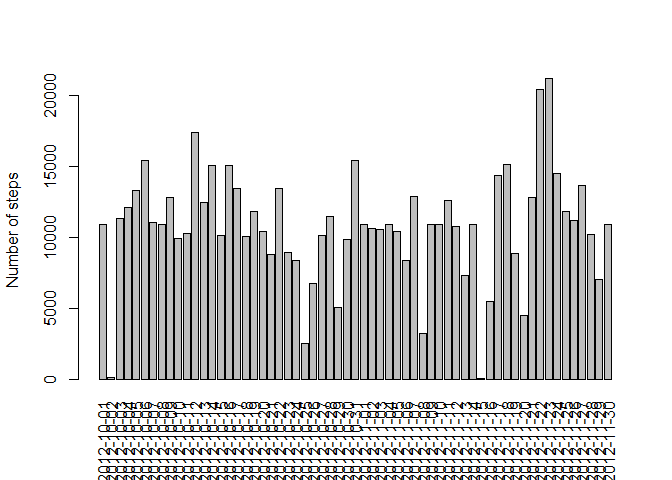

# Reproducible Research: Peer Assessment 1
__Can we use the data gathered by activity monitoring devices, like smartbands, to discover patterns within a population?__

## Loading and preprocessing the data

In order to grant a stable environment, we will start by setting the locale, in order to force the graphs to output data in english (with all the internationalization, number formatting, weekdays, etc.).


```r
Sys.setlocale("LC_TIME", "us")  
```

```
## [1] "English_United States.1252"
```


After we will load the content of the file that is distributed with the code, in the [git repository](https://github.com/paulovitorbal/RepData_PeerAssessment1);

Look that I check if the CSV file exists, if not, I will try to unzip. Verify if you have the activity.zip, or activity.csv in your working directory;


```r
if (!file.exists("activity.csv"))
  unzip("activity.zip")
activity <- read.csv("activity.csv") 
summary(activity)
```

```
##      steps                date          interval     
##  Min.   :  0.00   2012-10-01:  288   Min.   :   0.0  
##  1st Qu.:  0.00   2012-10-02:  288   1st Qu.: 588.8  
##  Median :  0.00   2012-10-03:  288   Median :1177.5  
##  Mean   : 37.38   2012-10-04:  288   Mean   :1177.5  
##  3rd Qu.: 12.00   2012-10-05:  288   3rd Qu.:1766.2  
##  Max.   :806.00   2012-10-06:  288   Max.   :2355.0  
##  NA's   :2304     (Other)   :15840
```

We already have our dataset ready for the analysis.

## What is mean total number of steps taken per day?

To calculate the steps per day, I used the aggregate function, creating a subset of data with the dates and the sum of the steps.


```r
steps.per.day <- aggregate(steps ~ date, data = activity, sum)
```

And with the new subset we can check the mean and median.


```r
print(paste("Mean:", mean(steps.per.day$steps),"Median is:", median(steps.per.day$steps)))
```

```
## [1] "Mean: 10766.1886792453 Median is: 10765"
```

We will use a histogram to explore the distribuition and vissualy compare the number of steps per day.


```r
barplot(steps.per.day$steps, names.arg = steps.per.day$date, xlab = "", ylab = "Number of steps", las = 3)
```

\

## What is the average daily activity pattern?

To evaluate the activity (measured by steps), we will make a time series plot, considering the average number of steps in a determined interval. 

You will notice that the common pattern is to be less active before 5 am (interval < 500) or after 8 pm (interval > 2000).


In order to get the plot, first we need to subset the main dataset aggregating the steps by interval, after this step we will set the name of the variables and then we will plot the time series graph.


```r
steps.per.5m.interval <- aggregate(steps ~ interval, data = activity, mean)
names(steps.per.5m.interval) <- c("5-minute interval", "Average number of steps taken")
plot(steps.per.5m.interval, type="l")
```

\

We can check the interval where the number of steps were the highest.


```r
steps.per.5m.interval[which.max(steps.per.5m.interval[, 2]), 1]
```

```
## [1] 835
```

## Imputing missing values

The data collected was within October and November, 2012. But we have many missing values, for example, in 2012-10-01, there is no step recorded. 

In order to reduce the number of missing values, we will use the _average number of steps per interval_ in the days where the number of steps for that interval was avaliable (not missing value).


How many missing step values do we have? First of all, we will check this.


```r
"missing values: "
```

```
## [1] "missing values: "
```

```r
sum(!complete.cases(activity))
```

```
## [1] 2304
```

```r
" in %: "
```

```
## [1] " in %: "
```

```r
round((sum(!complete.cases(activity)) / nrow(activity)) * 100,digits = 2)
```

```
## [1] 13.11
```

As this is an expressive value of missing data, we will use the strategy commented before.

First, we will create a data set with the average number of steps per interval. And we will round this number up, because we can't work with float numbers, it doesn't make sense, that a person gave 12.65 steps in a  5 minutes interval.


```r
avgSteps <- aggregate(steps~interval, activity[!is.na(activity$steps),], mean)
avgSteps$steps <- ceiling(avgSteps$steps)
```


Then, we will create a copy of the original data set:


```r
activityCompleted <- activity
```

At least, we will iterate over the dataset, checking if there is a missing value in the step variable, if so, we will use the reference data set for average steps by interval.


```r
numberOfRows <- nrow(activityCompleted)
for(row in c(1:numberOfRows)){
  if (is.na(activityCompleted[row,"steps"])){
    activityCompleted[row,"steps"] <- avgSteps[avgSteps$interval == activityCompleted[row,"interval"], "steps"]
  }
}
```

We will plot the same graph that we make before:


```r
steps.per.day1 <- aggregate(steps ~ date, data = activityCompleted, sum)
barplot(steps.per.day1$steps, names.arg = steps.per.day1$date, 
        xlab = "", ylab = "Number of steps", las = 3)
```

\

And we will check again the mean and the median, now considering the NA values replaced by the mean by interval.

The values below are considering the average for the interval for the values that are missing!


```r
paste("Mean:", mean(steps.per.day1$steps),"Median is:", median(steps.per.day1$steps))
```

```
## [1] "Mean: 10784.9180327869 Median is: 10909"
```
## Are there differences in activity patterns between weekdays and weekends?

To answer this question, we will create another variable to correspond if it is a week day, or a weekend day.


```r
activity$type <- as.factor(sapply(activity$date, FUN = function(date){if (weekdays(as.Date(date)) %in% c("Saturday","Sunday")) "weekend" else "weekday"}))
```

After we will make two plots, in order to do so, we will split the data, and calculate the mean:


```r
x <- split(activity, activity$type)
steps.weekdays <- x[[1]]
steps.weekend <- x[[2]]
steps.weekdays <- aggregate(steps ~ interval, data = steps.weekdays, mean)
steps.weekend <- aggregate(steps ~ interval, data = steps.weekend, mean)
```

At least, we will plot the graphics:

```r
par(mfrow = c(2, 1))

plot(steps.weekend, type = "l", xlab = "Interval",
     ylab = "Number of steps", main = "Weekend")
plot(steps.weekdays, type = "l", xlab = "Interval",
     ylab = "Number of steps", main = "Weekday")
```

\


We can see that on weekends the activities are distributed all day long, and on week days, the activities are concentrated on the morning.
